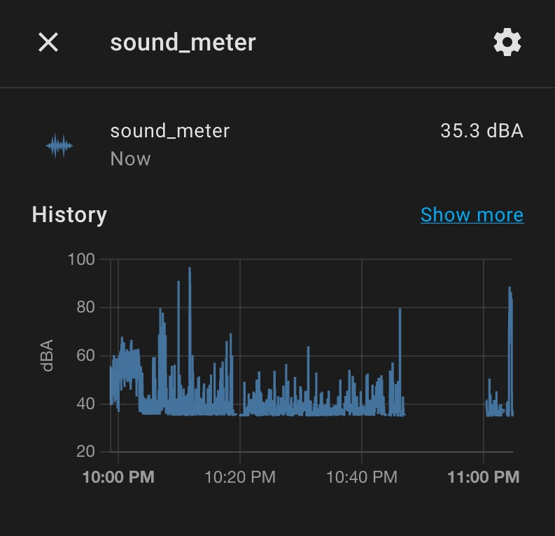

# ESPHome Component: Uni-T (Uni Trend) Mini Sound Level Meter

This is a bridge for a [Uni-T Mini Sound Level Meter UT353BT](https://meters.uni-trend.com/product/ut353-ut353bt/) and an [ESP32 device](https://esphome.io/devices/esp32.html).

After this integration, the sound meter can work with Home Assitant. Every time the meter is powered on and its Bluetooth is enabled, ESP32 device can connect to it automatically and start to collect the measurement [dBA](https://www.nexflow.com/blog/what-does-dba-mean/).


## Dependencies

* This component requires an [ESP32 device](https://esphome.io/devices/esp32.html).
* [ESPHome 2022.4.0 or higher](https://github.com/esphome/esphome/releases).

## Installation

You can install this component with [ESPHome external components feature](https://esphome.io/components/external_components.html) like this:
```yaml
external_components:
  - source: github://daweizhangau/esphome_uni_trend_sound_meter@main
```

## Configuration

You need the following components. For full configuration example, please reference to [esphome_config_sample.yaml](esphome_config_sample.yaml).

### Find MAC Address

[esp32_ble_tracker](https://esphome.io/components/esp32_ble_tracker.html) component should be able to detect it when you turn on Bluetooth on your sound meter, and print it in the log.

1. Add `esp32_ble_tracker` to your ESPHome device config
    ```yaml
    esp32_ble_tracker:

    text_sensor:
      - platform: ble_scanner
        name: "BLE Devices Scanner"
    ```
2. Install to ESP32 device
3. Open log of your ESP32 device
4. Turn on Bluetooth of your sound meter
5. Look for 
    ```text
    [...[D][text_sensor:064]: 'BLE Devices Scanner': Sending state '{"timestamp":131,"address":"00:00:00:00:00:00","rssi":-48,"name":"UT353BT"}'
    ```
`00:00:00:00:00:00` above is MAC address of your sound meter.

### BLE Client

Then configure [ESPHome BLE Client](https://esphome.io/components/ble_client.html) (check the documentation for more information):

```yaml

ble_client:
  - mac_address: "00:00:00:00:00:00" # Replace with your sound meter bluetooth mac address
    id: sound_meter_ble_client
```

### Sound Meter

Then you need to enable this component with the id of the ble_client component.

```yaml
uni_trend_sound_meter:
    # [Required] Name or ID is required.
    name: "Sound Level"
    # [Optional] Enhance entity with icon and unit.
    icon: 'mdi:microphone'
    # [Optional] Defaut value is dBA
    unit_of_measurement: 'dBA'
    # [Required] Reference to the ble_client.id set above
    ble_client_id: sound_meter_ble_client
    # [Optional] Reference to
    update_interval: 1s
```

## References

* https://esphome.io/components/ble_client.html
* https://esphome.io/components/sensor/ble_client.html
* https://github.com/esphome/esphome/tree/dev/esphome/components/ble_client/sensor
